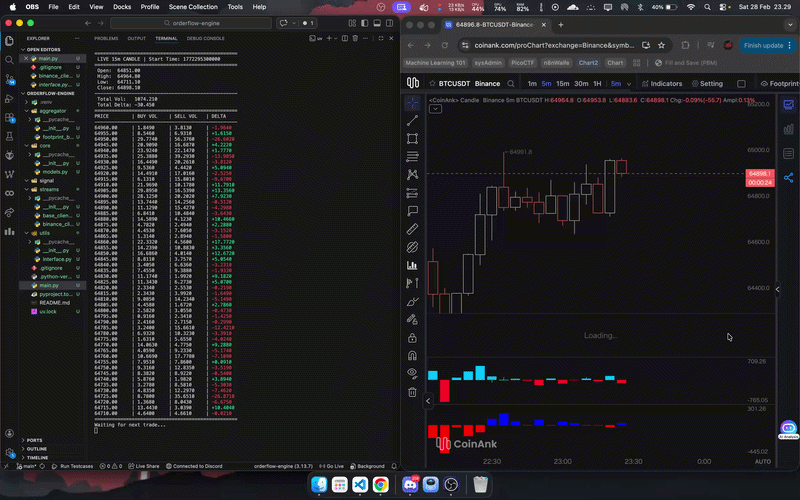

# **orderflow-engine**

**Cryptocurrency orderflow engine built in Python.**  
Designed to stream and process live market data.   
The engine acts as a real-time state machine that **aggregates raw trades into precise footprint candles**. It groups tiny price movements into bins (like $5 tick / bin) to track the exact buy volume, sell volume, and delta at every single bin price level.

## **Simple Demo**
